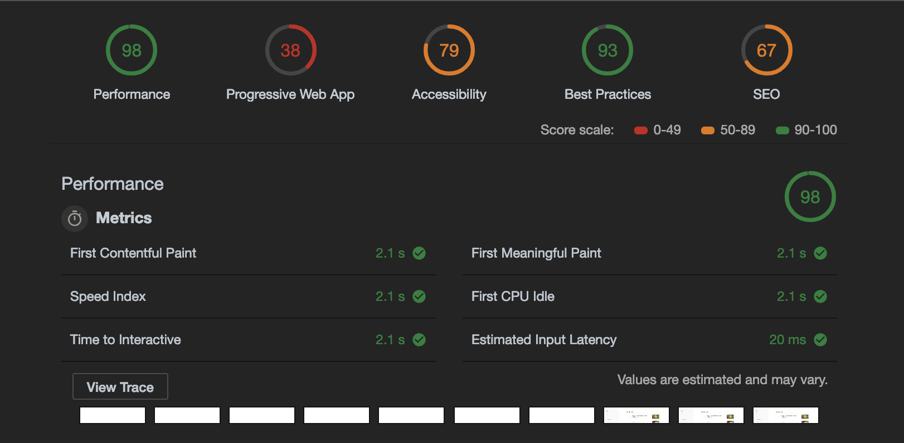

# Performance Matters @cmda-minor-web · 2018-2019

In this subject I'm going to improve the performance of my Reddit application.


## Installation

```bash
git clone https://github.com/timruiterkamp/performance-matters-1819.git
cd performance-matters-1819
yarn or npm install
yarn start or npm start

visit site on http://localhost:1337

Enjoy!
```

## Week 1

This week was all about setting up the API and using server side rendering to display pages.

## Week 2

Improving the performance of my app was my main goal this week. The first test I ran was a normal audit and these were the results:  
  
The time for the first byte is really slow without compression and a quite slow API.

### Minification

The first step I focussed on was to minify my scss and javascript files.
For example, to minify my scss I used the node-sass compressed output, the complete build would look like this:

```json
[
  {
    "start": "concurrently \"yarn build\" \"node_modules/.bin/nodemon server\"",
    "build": "concurrently \"yarn minify-scss\" \"yarn minifyjs\"",
    "watch": "concurrently \"yarn run sass-watch\" \"yarn minifyjs\"",
    "clean": "node_modules/.bin/gulp clean",
    "minifyjs": "node_modules/.bin/gulp minifyJS",
    "sass": "node_modules/.bin/node-sass --include-path scss sass/index.scss dist/styles/min-main.css",
    "minify-scss": "node_modules/.bin/node-sass --include-path scss sass/index.scss dist/styles/min-main.css --output-style compressed",
    "sass-watch": "node_modules/.bin/nodemon -e scss -x npm run sass"
  }
]
```

I used concurrently to make sure my scripts wouldn't be blocking and run after eachother.  
The reason I went with base path was that the project will work for everyone, even if you don't have anything installed globally.

Results:
The time to first byte improved from 2.5 to 2.1 seconds. Which is actually a quite big improvement for just minification.


### Compression & cache

The next step I took was use the shrinkray compression and set the cache headers.
This was quite a big improvement on the load time, as the speed was decreased to 1.4 seconds. A difference of .7 seconds.


### Static files

I was not really satisfied with the results as the API was still slow which resulted in the 1.4 seconds delay.  
So my take on that was to create a static json file which the data would be served from after the first call is made.  
I still have to make cronjobs to update the files as it will not do another called when the data is generated.

The results were very good tho:  


### Service worker

In the last week I implemented a service worker which works with the cache and update way. I got my information from the mozilla service worker cookbook, which has some nice examples.  
The service worker gives the ability to create meaningfull offline pages and caches the pages you have already loaded which can be then visit with or without internet.

After the service workers was implemented the optimalisation went even further and I brought the loading time back to .3 seconds.


If the service worker is active and the page can't be loaded because there is no internet, the following message will be displayed:  


### Further ex

## To Do

- [ ] Add same static file support for subpages
- [ ] Add cronjobs
- [x] Integrate service workers
- [x] Deploy to heroku
